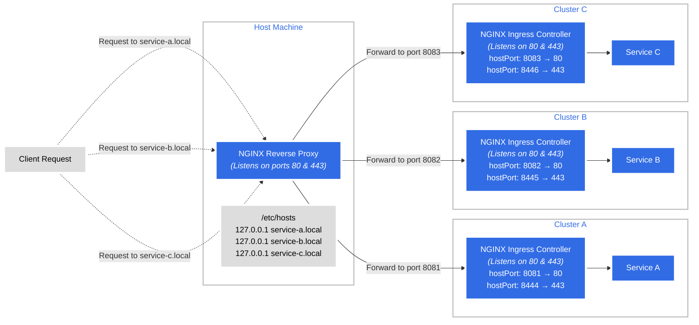
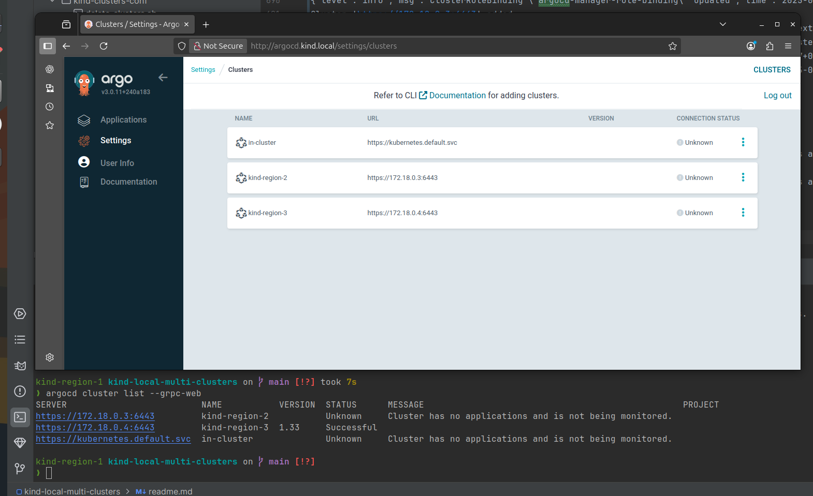

# Kind Multi-Clusters Environment


This setup demonstrates how to run multiple local Kubernetes clusters using kind, each with its own NGINX Ingress controller, and expose their services on the host machine using a shared NGINX reverse proxy. Each cluster maps its ingress ports to unique host ports, while the reverse proxy routes requests based on hostname to the appropriate cluster. The `/etc/hosts` file or custom DNS entries are used to resolve service hostnames locally, enabling seamless access to services running in different clusters as if they were on separate domains. The diagram below illustrates the flow of requests from the client, through the reverse proxy, and into the respective Kubernetes clusters.




```bash
❯ cat kind-clusters-conf/*
kind: Cluster
apiVersion: kind.x-k8s.io/v1alpha4
name: region-a1
nodes:
- role: control-plane
  extraPortMappings:
  - containerPort: 80
    hostPort: 8081
    protocol: TCP
  - containerPort: 443
    hostPort: 8444
    protocol: TCP
kind: Cluster
apiVersion: kind.x-k8s.io/v1alpha4
name: region-b1
nodes:
- role: control-plane
  extraPortMappings:
  - containerPort: 80
    hostPort: 8082
    protocol: TCP
  - containerPort: 443
    hostPort: 8445
    protocol: TCP

❯ k --context kind-region-a1 get ing,svc,ep,po
NAME                                          CLASS    HOSTS             ADDRESS     PORTS   AGE
ingress.networking.k8s.io/service-a-ingress   <none>   service-a.local   localhost   80      30m

NAME                        TYPE        CLUSTER-IP    EXTERNAL-IP   PORT(S)    AGE
service/kubernetes          ClusterIP   10.96.0.1     <none>        443/TCP    47m
service/service-a-service   ClusterIP   10.96.53.12   <none>        8080/TCP   30m

NAME                          ENDPOINTS         AGE
endpoints/kubernetes          172.18.0.2:6443   47m
endpoints/service-a-service   10.244.0.8:8080   30m

NAME                READY   STATUS    RESTARTS   AGE
pod/service-a-app   1/1     Running   0          30m

on kind-region-b1 kind-local-multi-clusters on  main [!?] 
❯ k --context kind-region-b1 get ing,svc,ep,po
NAME                                          CLASS    HOSTS             ADDRESS     PORTS   AGE
ingress.networking.k8s.io/service-b-ingress   <none>   service-b.local   localhost   80      30m

NAME                        TYPE        CLUSTER-IP     EXTERNAL-IP   PORT(S)    AGE
service/kubernetes          ClusterIP   10.96.0.1      <none>        443/TCP    47m
service/service-b-service   ClusterIP   10.96.34.178   <none>        8080/TCP   30m

NAME                          ENDPOINTS          AGE
endpoints/kubernetes          172.18.0.3:6443    47m
endpoints/service-b-service   10.244.0.12:8080   30m

NAME                READY   STATUS    RESTARTS   AGE
pod/service-b-app   1/1     Running   0          30m

on kind-region-b1 kind-local-multi-clusters on  main [!?] 


on kind-region-b1 kind-local-multi-clusters on  main [!?] 
❯ docker ps
CONTAINER ID   IMAGE                  COMMAND                  CREATED          STATUS          PORTS                                                                    NAMES
8e311eb46f2b   nginx-proxy            "/docker-entrypoint.…"   23 minutes ago   Up 23 minutes   0.0.0.0:80->80/tcp                                                       sad_curie
9de1febf21e6   kindest/node:v1.31.0   "/usr/local/bin/entr…"   49 minutes ago   Up 49 minutes   0.0.0.0:8082->80/tcp, 0.0.0.0:8445->443/tcp, 127.0.0.1:41563->6443/tcp   region-b1-control-plane
eb8b157d79d3   kindest/node:v1.31.0   "/usr/local/bin/entr…"   49 minutes ago   Up 49 minutes   0.0.0.0:8081->80/tcp, 0.0.0.0:8444->443/tcp, 127.0.0.1:40429->6443/tcp   region-a1-control-plane

on kind-region-b1 kind-local-multi-clusters on  main [!?] 


on kind-region-b1 kind-local-multi-clusters on  main [!?] 
❯ 
```


Accessing applications over HTTP from the local host to each cluster's ingress controller.
```bash
on kind-region-b1 kind-local-multi-clusters on  main [!?] 
❯ cat /etc/hosts
# This file was automatically generated by WSL. To stop automatic generation of this file, add the following entry to /etc/wsl.conf:
# [network]
# generateHosts = false
127.0.0.1       localhost
127.0.1.1       DESKTOP-FM7N9C9.localdomain     DESKTOP-FM7N9C9


127.0.0.1 service-a.local
127.0.0.1 service-b.local

# The following lines are desirable for IPv6 capable hosts
::1     ip6-localhost ip6-loopback
fe00::0 ip6-localnet
ff00::0 ip6-mcastprefix
ff02::1 ip6-allnodes
ff02::2 ip6-allrouters

on kind-region-b1 kind-local-multi-clusters on  main [!?] 
❯ curl http://service-a.local/
service-a-app
on kind-region-b1 kind-local-multi-clusters on  main [!?] 
❯ curl http://service-b.local/
service-b-app
on kind-region-b1 kind-local-multi-clusters on  main [!?] 
❯ 
```


How to Resolve Multi-Node Ingress Issues

Problem:
When deploying Ingress on a multi-node kind cluster, only the control plane node exposes its container port to the host. Therefore, if the NGINX Ingress controller pod is scheduled on a different node (such as a worker node), its service will not be reachable from the user’s host.

Solution:
To overcome this, we need to allow the Ingress controller pod to be scheduled on the control plane node. The recommended way is to use taints and tolerations. Since the only node that exposes ports (via container ports mapped to the host) is the control plane, the NGINX Ingress controller should run there. This allows access to Ingress controller ports (80, 443) from the host.

With this setup, we can achieve a multi-node cluster (n > 1), where each cluster has its own Ingress controller properly exposed.


```yaml
---
apiVersion: apps/v1
kind: Deployment
metadata:
  labels:
    app.kubernetes.io/component: controller
    app.kubernetes.io/instance: ingress-nginx
    app.kubernetes.io/name: ingress-nginx
    app.kubernetes.io/part-of: ingress-nginx
    app.kubernetes.io/version: 1.12.1
  name: ingress-nginx-controller
  namespace: ingress-nginx
spec:
  minReadySeconds: 0
  revisionHistoryLimit: 10
  selector:
    matchLabels:
      app.kubernetes.io/component: controller
      app.kubernetes.io/instance: ingress-nginx
      app.kubernetes.io/name: ingress-nginx
  strategy:
    rollingUpdate:
      maxUnavailable: 1
    type: RollingUpdate
  template:
    metadata:
      labels:
        app.kubernetes.io/component: controller
        app.kubernetes.io/instance: ingress-nginx
        app.kubernetes.io/name: ingress-nginx
        app.kubernetes.io/part-of: ingress-nginx
        app.kubernetes.io/version: 1.12.1
    spec:
      tolerations:
        - key: "node-role.kubernetes.io/control-plane"
          operator: "Exists"
          effect: "NoSchedule"
```


-------------

<br/>

Test withou update to `/etc/hosts`


Cluter A
```bash
curl --resolve service-a.local:8081:127.0.0.1 http://service-a.local:8081/
curl --resolve 172.18.0.5:8081:127.0.0.1 http://service-a.local:8081/
```
172.18.0.5


Cluster B
```bash
`curl --resolve service-b.local:8082:127.0.0.1 http://service-b.local:8082/
````


Updated `/ets/hosts1`

```bash

127.0.0.1 service-a.local
127.0.0.1 service-b.local

```

```bash
❯ curl http://service-a.local/ && echo "" && curl http://service-b.local/
service-a-app
service-b-app
on kind-region-a1 ~
❯
```


```
❯ docker exec -it 8e311eb46f2b cat /etc/nginx/conf.d/default.conf
server {
    listen 80;
    server_name service-a.local;

    location / {
        proxy_pass http://host.docker.internal:8081;
        proxy_set_header Host $host;
        proxy_set_header X-Real-IP $remote_addr;
    }
}

server {
    listen 80;
    server_name service-b.local;

    location / {
        proxy_pass http://host.docker.internal:8082;
        proxy_set_header Host $host;
        proxy_set_header X-Real-IP $remote_addr;
    }
}
```

```bash
docker build -t nginx-proxy . && docker run --net=host --rm -p 80:80 nginx-proxy
```


---


Alternative to the nginx-proxy laye : docker cotiner  ip ass api-server addr:


❯ docker inspect -f '{{range .NetworkSettings.Networks}}{{.IPAddress}}{{end}}' region-a1-control-plane
172.18.0.5

on kind-region-a1 ~
❯ docker inspect -f '{{range .NetworkSettings.Networks}}{{.IPAddress}}{{end}}' region-b1-control-plane
172.18.0.9

on kind-region-a1 ~
❯

 


### TBN:

- [x] Managed to configure pods inside Cluster A to reach the ingress for a service inside Cluster B.

- [x] SSL Termination: If you require HTTPS support, you can configure SSL certificates in the NGINX reverse proxy to handle SSL termination.

Automation: For dynamic environments, consider using tools like nginx-proxy or Traefik that can automatically configure reverse proxies for Docker containers based on labels.


---
## Clusters creations setups :

```yaml
❯ ./setup/local-setup.sh 
[INFO] Creating local registry container kind-registry on port 5001...
Unable to find image 'registry:2' locally
2: Pulling from library/registry
44cf07d57ee4: Pull complete 
bbbdd6c6894b: Pull complete 
8e82f80af0de: Pull complete 
3493bf46cdec: Pull complete 
6d464ea18732: Pull complete 
Digest: sha256:a3d8aaa63ed8681a604f1dea0aa03f100d5895b6a58ace528858a7b332415373
Status: Downloaded newer image for registry:2
f6ea523a8e217dfdd6c6588553c9fc170e7375d290b116c289420c845cf3c04e
[INFO] Connecting registry to kind network...
[INFO] Pulling registry.k8s.io/ingress-nginx/controller:v1.12.1
v1.12.1: Pulling from ingress-nginx/controller
f18232174bc9: Pull complete 
6596516c3260: Pull complete 
a745d0b9e405: Pull complete 
d46eb76ee96b: Pull complete 
d2275420c3b6: Pull complete 
5cc7b5e30a50: Pull complete 
4f4fb700ef54: Pull complete 
280d8b867efa: Pull complete 
c59176407fc2: Pull complete 
6a14330bf5c4: Pull complete 
6c429cd6f96a: Pull complete 
8bfbec0fd7ed: Pull complete 
3643aa58ecc5: Pull complete 
b9fced2781ac: Pull complete 
cd7a4d409e59: Pull complete 
Digest: sha256:d2fbc4ec70d8aa2050dd91a91506e998765e86c96f32cffb56c503c9c34eed5b
Status: Downloaded newer image for registry.k8s.io/ingress-nginx/controller:v1.12.1
registry.k8s.io/ingress-nginx/controller:v1.12.1
[INFO] Tagging registry.k8s.io/ingress-nginx/controller:v1.12.1 as localhost:5001/ingress-nginx/controller:v1.12.1
[INFO] Pushing localhost:5001/ingress-nginx/controller:v1.12.1 to local registry
The push refers to repository [localhost:5001/ingress-nginx/controller]
ff58054a3da7: Pushed 
c99a2efa7f29: Pushed 
a956c4bc2c70: Pushed 
ff5d99c9001f: Pushed 
a69b043b552a: Pushed 
9a1dc1ad87e8: Pushed 
9a206f25d9a0: Pushed 
03bbbdd795fb: Pushed 
5f70bf18a086: Pushed 
e50c2f1aabef: Pushed 
15ad6647c798: Pushed 
0a640871af32: Pushed 
a68809020409: Pushed 
ea5887115ab2: Pushed 
08000c18d16d: Pushed 
v1.12.1: digest: sha256:466e6b255d776c237286f013efe14da1477b172a2f444ca6806d66c9fad27111 size: 3466
[INFO] Pulling registry.k8s.io/ingress-nginx/kube-webhook-certgen:v1.4.4
v1.4.4: Pulling from ingress-nginx/kube-webhook-certgen
c6b97f964990: Pull complete 
bfb59b82a9b6: Pull complete 
8ffb3c3cf71a: Pull complete 
a62778643d56: Pull complete 
7c12895b777b: Pull complete 
33e068de2649: Pull complete 
5664b15f108b: Pull complete 
0bab15eea81d: Pull complete 
4aa0ea1413d3: Pull complete 
da7816fa955e: Pull complete 
9aee425378d2: Pull complete 
d711cc0b3a79: Pull complete 
Digest: sha256:a9f03b34a3cbfbb26d103a14046ab2c5130a80c3d69d526ff8063d2b37b9fd3f
Status: Downloaded newer image for registry.k8s.io/ingress-nginx/kube-webhook-certgen:v1.4.4
registry.k8s.io/ingress-nginx/kube-webhook-certgen:v1.4.4
[INFO] Tagging registry.k8s.io/ingress-nginx/kube-webhook-certgen:v1.4.4 as localhost:5001/ingress-nginx/kube-webhook-certgen:v1.4.4
[INFO] Pushing localhost:5001/ingress-nginx/kube-webhook-certgen:v1.4.4 to local registry
The push refers to repository [localhost:5001/ingress-nginx/kube-webhook-certgen]
252d530f1cbe: Pushed 
b336e209998f: Pushed 
f4aee9e53c42: Pushed 
1a73b54f556b: Pushed 
2a92d6ac9e4f: Pushed 
bbb6cacb8c82: Pushed 
ac805962e479: Pushed 
af5aa97ebe6c: Pushed 
4d049f83d9cf: Pushed 
ddc6e550070c: Pushed 
8fa10c0194df: Pushed 
d37950ece3d3: Pushed 
v1.4.4: digest: sha256:6b33a8870727f3e7de55d88283cc778e1775d8099c36c45d095aa831d0f0fbc7 size: 2814
[INFO] Deleting existing kind clusters if any...
[INFO] Deleting cluster: region-1
Deleting cluster "region-1" ...
Deleted nodes: ["region-1-control-plane"]
[INFO] Deleting cluster: region-2
Deleting cluster "region-2" ...
Deleted nodes: ["region-2-control-plane"]
[INFO] Deleting cluster: region-3
Deleting cluster "region-3" ...
Deleted nodes: ["region-3-control-plane"]
[INFO] Creating kind clusters...
[INFO] Creating cluster: region-1
[DEBUG] Cluster config for region-1:
kind: Cluster
apiVersion: kind.x-k8s.io/v1alpha4
containerdConfigPatches:
- |-
  [plugins."io.containerd.grpc.v1.cri".registry]
    config_path = "/etc/containerd/certs.d"
nodes:
- role: control-plane
  extraPortMappings:
  - containerPort: 80
    hostPort: 8081
    protocol: TCP
  - containerPort: 443
    hostPort: 8444
    protocol: TCP
Creating cluster "region-1" ...
 ✓ Ensuring node image (kindest/node:v1.33.1) 🖼
 ✓ Preparing nodes 📦  
 ✓ Writing configuration 📜 
 ✓ Starting control-plane 🕹️ 
 ✓ Installing CNI 🔌 
 ✓ Installing StorageClass 💾 
Set kubectl context to "kind-region-1"
You can now use your cluster with:

kubectl cluster-info --context kind-region-1

Have a question, bug, or feature request? Let us know! https://kind.sigs.k8s.io/#community 🙂
[INFO] Creating cluster: region-2
[DEBUG] Cluster config for region-2:
kind: Cluster
apiVersion: kind.x-k8s.io/v1alpha4
containerdConfigPatches:
- |-
  [plugins."io.containerd.grpc.v1.cri".registry]
    config_path = "/etc/containerd/certs.d"
nodes:
- role: control-plane
  extraPortMappings:
  - containerPort: 80
    hostPort: 8082
    protocol: TCP
  - containerPort: 443
    hostPort: 8445
    protocol: TCP
Creating cluster "region-2" ...
 ✓ Ensuring node image (kindest/node:v1.33.1) 🖼
 ✓ Preparing nodes 📦  
 ✓ Writing configuration 📜 
 ✓ Starting control-plane 🕹️ 
 ✓ Installing CNI 🔌 
 ✓ Installing StorageClass 💾 
Set kubectl context to "kind-region-2"
You can now use your cluster with:

kubectl cluster-info --context kind-region-2

Have a nice day! 👋
[INFO] Creating cluster: region-3
[DEBUG] Cluster config for region-3:
kind: Cluster
apiVersion: kind.x-k8s.io/v1alpha4
containerdConfigPatches:
- |-
  [plugins."io.containerd.grpc.v1.cri".registry]
    config_path = "/etc/containerd/certs.d"
nodes:
- role: control-plane
  extraPortMappings:
  - containerPort: 80
    hostPort: 8083
    protocol: TCP
  - containerPort: 443
    hostPort: 8446
    protocol: TCP
Creating cluster "region-3" ...
 ✓ Ensuring node image (kindest/node:v1.33.1) 🖼
 ✓ Preparing nodes 📦  
 ✓ Writing configuration 📜 
 ✓ Starting control-plane 🕹️ 
 ✓ Installing CNI 🔌 
 ✓ Installing StorageClass 💾 
Set kubectl context to "kind-region-3"
You can now use your cluster with:

kubectl cluster-info --context kind-region-3

Have a question, bug, or feature request? Let us know! https://kind.sigs.k8s.io/#community 🙂
[INFO] Waiting for all nodes in each cluster to be ready...
[INFO] Checking nodes in cluster: region-1✔️
[INFO] Checking nodes in cluster: region-2✔️
[INFO] Checking nodes in cluster: region-3✔️
[INFO] Configuring registry on node region-1-control-plane for region-1
[INFO] Configuring registry on node region-2-control-plane for region-2
[INFO] Configuring registry on node region-3-control-plane for region-3
[INFO] Deploying ingress controllers and services...
[INFO] Deploying ingress controller for region-1
namespace/ingress-nginx created
serviceaccount/ingress-nginx created
serviceaccount/ingress-nginx-admission created
role.rbac.authorization.k8s.io/ingress-nginx created
role.rbac.authorization.k8s.io/ingress-nginx-admission created
clusterrole.rbac.authorization.k8s.io/ingress-nginx created
clusterrole.rbac.authorization.k8s.io/ingress-nginx-admission created
rolebinding.rbac.authorization.k8s.io/ingress-nginx created
rolebinding.rbac.authorization.k8s.io/ingress-nginx-admission created
clusterrolebinding.rbac.authorization.k8s.io/ingress-nginx created
clusterrolebinding.rbac.authorization.k8s.io/ingress-nginx-admission created
configmap/ingress-nginx-controller created
service/ingress-nginx-controller created
service/ingress-nginx-controller-admission created
deployment.apps/ingress-nginx-controller created
job.batch/ingress-nginx-admission-create created
job.batch/ingress-nginx-admission-patch created
ingressclass.networking.k8s.io/nginx created
validatingwebhookconfiguration.admissionregistration.k8s.io/ingress-nginx-admission created
[INFO] Waiting for pods in ingress-nginx (context: kind-region-1) to be ready✔️
[INFO] Deploying service application for region-1
[INFO] Deploying ingress controller for region-2
namespace/ingress-nginx created
serviceaccount/ingress-nginx created
serviceaccount/ingress-nginx-admission created
role.rbac.authorization.k8s.io/ingress-nginx created
role.rbac.authorization.k8s.io/ingress-nginx-admission created
clusterrole.rbac.authorization.k8s.io/ingress-nginx created
clusterrole.rbac.authorization.k8s.io/ingress-nginx-admission created
rolebinding.rbac.authorization.k8s.io/ingress-nginx created
rolebinding.rbac.authorization.k8s.io/ingress-nginx-admission created
clusterrolebinding.rbac.authorization.k8s.io/ingress-nginx created
clusterrolebinding.rbac.authorization.k8s.io/ingress-nginx-admission created
configmap/ingress-nginx-controller created
service/ingress-nginx-controller created
service/ingress-nginx-controller-admission created
deployment.apps/ingress-nginx-controller created
job.batch/ingress-nginx-admission-create created
job.batch/ingress-nginx-admission-patch created
ingressclass.networking.k8s.io/nginx created
validatingwebhookconfiguration.admissionregistration.k8s.io/ingress-nginx-admission created
[INFO] Waiting for pods in ingress-nginx (context: kind-region-2) to be ready✔️
[INFO] Deploying service application for region-2
[INFO] Deploying ingress controller for region-3
namespace/ingress-nginx created
serviceaccount/ingress-nginx created
serviceaccount/ingress-nginx-admission created
role.rbac.authorization.k8s.io/ingress-nginx created
role.rbac.authorization.k8s.io/ingress-nginx-admission created
clusterrole.rbac.authorization.k8s.io/ingress-nginx created
clusterrole.rbac.authorization.k8s.io/ingress-nginx-admission created
rolebinding.rbac.authorization.k8s.io/ingress-nginx created
rolebinding.rbac.authorization.k8s.io/ingress-nginx-admission created
clusterrolebinding.rbac.authorization.k8s.io/ingress-nginx created
clusterrolebinding.rbac.authorization.k8s.io/ingress-nginx-admission created
configmap/ingress-nginx-controller created
service/ingress-nginx-controller created
service/ingress-nginx-controller-admission created
deployment.apps/ingress-nginx-controller created
job.batch/ingress-nginx-admission-create created
job.batch/ingress-nginx-admission-patch created
ingressclass.networking.k8s.io/nginx created
validatingwebhookconfiguration.admissionregistration.k8s.io/ingress-nginx-admission created
[INFO] Waiting for pods in ingress-nginx (context: kind-region-3) to be ready✔️
[INFO] Deploying service application for region-3
[INFO] Environment setup completed successfully.
```


## Successfully tested  cross clusters access :


Argocd CD installtion on cluster kind-region-1

```bash
helm upgrade --install argocd argo/argo-cd \
  --namespace argocd \
  --create-namespace \
  -f argo-cd/argo-cd-values.yaml

```

ArgoCD CLI auth 


```bash

kind-region-1 kind-local-multi-clusters on  main [✘!?] 
❯ kubectl -n argocd get secret argocd-initial-admin-secret -o jsonpath="{.data.password}" | base64 -d
dCxZ9LjShSLZIlMr

kind-region-1  
❯ argocd app list --port-forward --port-forward-namespace=argocd --insecure --plaintext
NAME  CLUSTER  NAMESPACE  PROJECT  STATUS  HEALTH  SYNCPOLICY  CONDITIONS  REPO  PATH  TARGET

kind-region-1 ~ 
❯ argocd cluster list --port-forward --port-forward-namespace=argocd --insecure --plaintext
SERVER                          NAME        VERSION  STATUS   MESSAGE                                                  PROJECT
https://kubernetes.default.svc  in-cluster           Unknown  Cluster has no applications and is not being monitored.  

kind-region-1 ~ 
❯ 
```

Register A Cluster 

necessary when deploying to an external cluster. 

```bash
❯ kubectl config get-contexts -o name
kind-region-1
kind-region-2
kind-region-3

kind-region-1 kind-local-multi-clusters on  main [✘!?] 
❯ argocd cluster list --port-forward --port-forward-namespace=argocd --insecure --plaintext
SERVER                          NAME        VERSION  STATUS   MESSAGE                                                  PROJECT
https://kubernetes.default.svc  in-cluster           Unknown  Cluster has no applications and is not being monitored.  


```bash

kind-region-1 kind-local-multi-clusters on  main [!?] 
❯ argocd cluster add kind-region-2 --name kind-region-2 --grpc-web
argocd cluster add kind-region-3 --name kind-region-3 --grpc-web
WARNING: This will create a service account `argocd-manager` on the cluster referenced by context `kind-region-2` with full cluster level privileges. Do you want to continue [y/N]? y
{"level":"info","msg":"ServiceAccount \"argocd-manager\" already exists in namespace \"kube-system\"","time":"2025-07-24T22:49:40+03:00"}
{"level":"info","msg":"ClusterRole \"argocd-manager-role\" updated","time":"2025-07-24T22:49:40+03:00"}
{"level":"info","msg":"ClusterRoleBinding \"argocd-manager-role-binding\" updated","time":"2025-07-24T22:49:40+03:00"}
Cluster 'https://172.18.0.3:6443' added
WARNING: This will create a service account `argocd-manager` on the cluster referenced by context `kind-region-3` with full cluster level privileges. Do you want to continue [y/N]? y
{"level":"info","msg":"ServiceAccount \"argocd-manager\" already exists in namespace \"kube-system\"","time":"2025-07-24T22:49:47+03:00"}
{"level":"info","msg":"ClusterRole \"argocd-manager-role\" updated","time":"2025-07-24T22:49:47+03:00"}
{"level":"info","msg":"ClusterRoleBinding \"argocd-manager-role-binding\" updated","time":"2025-07-24T22:49:47+03:00"}
Cluster 'https://172.18.0.4:6443' added

```


It looks like using the Docker internal IP addresses for the Kind cluster API servers resolved the issue, 
and you've successfully added kind-region-2 and kind-region-3 to your Argo CD instance.

summary :

# Adding External Kind Clusters to Argo CD

When running Argo CD in one Kind cluster (e.g., `kind-region-1`) and attempting to add other Kind clusters (e.g., `kind-region-2`, `kind-region-3`) as external clusters, the Argo CD server needs to be able to reach the API servers of these external clusters.

The default Kind configuration exposes the API server on a random host port (e.g., `https://0.0.0.0:RANDOM_PORT`), which is not directly usable by the Argo CD pods. Using the Docker container hostnames (e.g., `region-2-control-plane`) also fails because these hostnames are not resolvable by the Argo CD server's internal DNS by default.

The solution is to use the **internal Docker IP addresses** of the Kind control plane containers for the external clusters.

## Action Items to Add External Kind Clusters:

1.  **Identify Docker Internal IP Addresses:**
    For each external Kind cluster's control plane container, find its Docker internal IP address.

```bash
kind-region-1 kind-local-multi-clusters on  main [!?]
❯ docker inspect -f '{{range .NetworkSettings.Networks}}{{.IPAddress}}{{end}}' region-2-control-plane
docker inspect -f '{{range .NetworkSettings.Networks}}{{.IPAddress}}{{end}}' region-3-control-plane
172.18.0.3
172.18.0.4

kind-region-1 kind-local-multi-clusters on  main [!?]
❯ kubectl config set-cluster kind-region-2 --server=https://172.18.0.3:6443
Cluster "kind-region-2" set.

kind-region-1 kind-local-multi-clusters on  main [!?]
❯ kubectl config set-cluster kind-region-3 --server=https://172.18.0.4:6443
Cluster "kind-region-3" set.

kind-region-1 kind-local-multi-clusters on  main [!?]
❯ argocd cluster add kind-region-2 --name kind-region-2 --grpc-web
argocd cluster add kind-region-3 --name kind-region-3 --grpc-web
WARNING: This will create a service account `argocd-manager` on the cluster referenced by context `kind-region-2` with full cluster level privileges. Do you want to continue [y/N]? y
{"level":"info","msg":"ServiceAccount \"argocd-manager\" already exists in namespace \"kube-system\"","time":"2025-07-24T22:49:40+03:00"}
{"level":"info","msg":"ClusterRole \"argocd-manager-role\" updated","time":"2025-07-24T22:49:40+03:00"}
{"level":"info","msg":"ClusterRoleBinding \"argocd-manager-role-binding\" updated","time":"2025-07-24T22:49:40+03:00"}
Cluster 'https://172.18.0.3:6443' added
WARNING: This will create a service account `argocd-manager` on the cluster referenced by context `kind-region-3` with full cluster level privileges. Do you want to continue [y/N]? y
{"level":"info","msg":"ServiceAccount \"argocd-manager\" already exists in namespace \"kube-system\"","time":"2025-07-24T22:49:47+03:00"}
{"level":"info","msg":"ClusterRole \"argocd-manager-role\" updated","time":"2025-07-24T22:49:47+03:00"}
{"level":"info","msg":"ClusterRoleBinding \"argocd-manager-role-binding\" updated","time":"2025-07-24T22:49:47+03:00"}
Cluster 'https://172.18.0.4:6443' added

kind-region-1 kind-local-multi-clusters on  main [!?] took 7s
❯ argocd cluster list --grpc-web
SERVER                          NAME           VERSION  STATUS      MESSAGE                                                  PROJECT
https://172.18.0.3:6443         kind-region-2           Unknown     Cluster has no applications and is not being monitored.  
https://172.18.0.4:6443         kind-region-3  1.33     Successful                                                           
https://kubernetes.default.svc  in-cluster              Unknown     Cluster has no applications and is not being monitored.

kind-region-1 kind-local-multi-clusters on  main [!?]
❯ 



