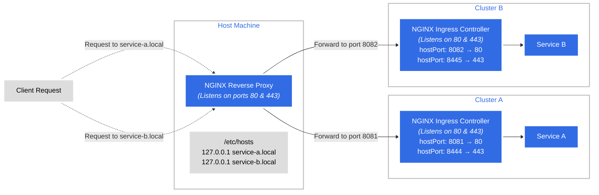

NGINX Reverse Prox Logic :

```bash
server {
    listen 80;
    server_name service-a.local;
    location / {
        proxy_pass http://localhost:8081;
    }
}

server {
    listen 80;
    server_name service-b.local;
    location / {
        proxy_pass http://localhost:8082;
    }
}
```


