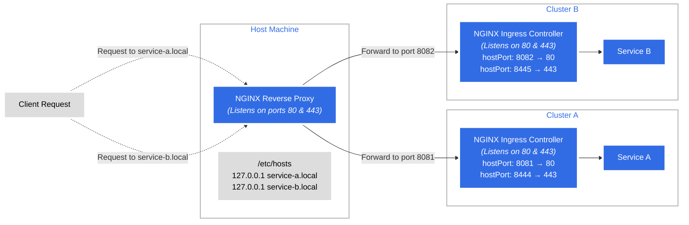
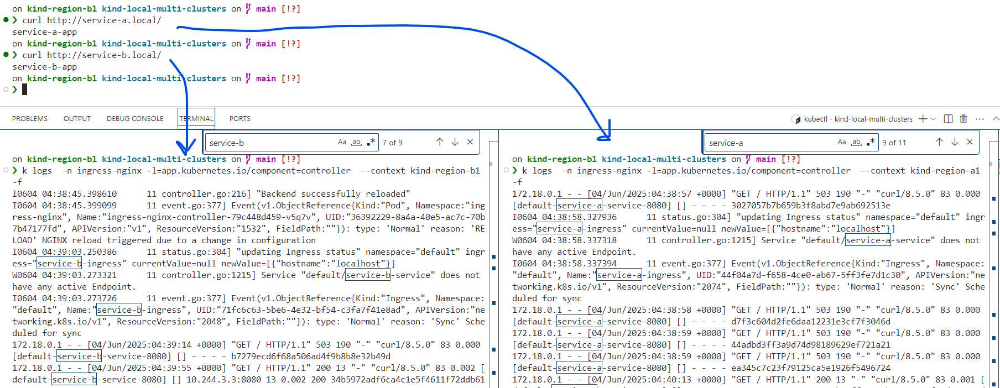

```bash
❯ cat kind-clusters-conf/*
kind: Cluster
apiVersion: kind.x-k8s.io/v1alpha4
name: region-a1
nodes:
- role: control-plane
  extraPortMappings:
  - containerPort: 80
    hostPort: 8081
    protocol: TCP
  - containerPort: 443
    hostPort: 8444
    protocol: TCP
kind: Cluster
apiVersion: kind.x-k8s.io/v1alpha4
name: region-b1
nodes:
- role: control-plane
  extraPortMappings:
  - containerPort: 80
    hostPort: 8082
    protocol: TCP
  - containerPort: 443
    hostPort: 8445
    protocol: TCP

❯ k --context kind-region-a1 get ing,svc,ep,po
NAME                                          CLASS    HOSTS             ADDRESS     PORTS   AGE
ingress.networking.k8s.io/service-a-ingress   <none>   service-a.local   localhost   80      30m

NAME                        TYPE        CLUSTER-IP    EXTERNAL-IP   PORT(S)    AGE
service/kubernetes          ClusterIP   10.96.0.1     <none>        443/TCP    47m
service/service-a-service   ClusterIP   10.96.53.12   <none>        8080/TCP   30m

NAME                          ENDPOINTS         AGE
endpoints/kubernetes          172.18.0.2:6443   47m
endpoints/service-a-service   10.244.0.8:8080   30m

NAME                READY   STATUS    RESTARTS   AGE
pod/service-a-app   1/1     Running   0          30m

on kind-region-b1 kind-local-multi-clusters on  main [!?] 
❯ k --context kind-region-b1 get ing,svc,ep,po
NAME                                          CLASS    HOSTS             ADDRESS     PORTS   AGE
ingress.networking.k8s.io/service-b-ingress   <none>   service-b.local   localhost   80      30m

NAME                        TYPE        CLUSTER-IP     EXTERNAL-IP   PORT(S)    AGE
service/kubernetes          ClusterIP   10.96.0.1      <none>        443/TCP    47m
service/service-b-service   ClusterIP   10.96.34.178   <none>        8080/TCP   30m

NAME                          ENDPOINTS          AGE
endpoints/kubernetes          172.18.0.3:6443    47m
endpoints/service-b-service   10.244.0.12:8080   30m

NAME                READY   STATUS    RESTARTS   AGE
pod/service-b-app   1/1     Running   0          30m

on kind-region-b1 kind-local-multi-clusters on  main [!?] 


on kind-region-b1 kind-local-multi-clusters on  main [!?] 
❯ docker ps
CONTAINER ID   IMAGE                  COMMAND                  CREATED          STATUS          PORTS                                                                    NAMES
8e311eb46f2b   nginx-proxy            "/docker-entrypoint.…"   23 minutes ago   Up 23 minutes   0.0.0.0:80->80/tcp                                                       sad_curie
9de1febf21e6   kindest/node:v1.31.0   "/usr/local/bin/entr…"   49 minutes ago   Up 49 minutes   0.0.0.0:8082->80/tcp, 0.0.0.0:8445->443/tcp, 127.0.0.1:41563->6443/tcp   region-b1-control-plane
eb8b157d79d3   kindest/node:v1.31.0   "/usr/local/bin/entr…"   49 minutes ago   Up 49 minutes   0.0.0.0:8081->80/tcp, 0.0.0.0:8444->443/tcp, 127.0.0.1:40429->6443/tcp   region-a1-control-plane

on kind-region-b1 kind-local-multi-clusters on  main [!?] 


on kind-region-b1 kind-local-multi-clusters on  main [!?] 
❯ 
```


Accessing applications over HTTP from the local host to each cluster's ingress controller.
```bash
on kind-region-b1 kind-local-multi-clusters on  main [!?] 
❯ cat /etc/hosts
# This file was automatically generated by WSL. To stop automatic generation of this file, add the following entry to /etc/wsl.conf:
# [network]
# generateHosts = false
127.0.0.1       localhost
127.0.1.1       DESKTOP-FM7N9C9.localdomain     DESKTOP-FM7N9C9


127.0.0.1 service-a.local
127.0.0.1 service-b.local

# The following lines are desirable for IPv6 capable hosts
::1     ip6-localhost ip6-loopback
fe00::0 ip6-localnet
ff00::0 ip6-mcastprefix
ff02::1 ip6-allnodes
ff02::2 ip6-allrouters

on kind-region-b1 kind-local-multi-clusters on  main [!?] 
❯ curl http://service-a.local/
service-a-app
on kind-region-b1 kind-local-multi-clusters on  main [!?] 
❯ curl http://service-b.local/
service-b-app
on kind-region-b1 kind-local-multi-clusters on  main [!?] 
❯ 
```


How to Resolve Multi-Node Ingress Issues

Problem:
When deploying Ingress on a multi-node kind cluster, only the control plane node exposes its container port to the host. Therefore, if the NGINX Ingress controller pod is scheduled on a different node (such as a worker node), its service will not be reachable from the user’s host.

Solution:
To overcome this, we need to allow the Ingress controller pod to be scheduled on the control plane node. The recommended way is to use taints and tolerations. Since the only node that exposes ports (via container ports mapped to the host) is the control plane, the NGINX Ingress controller should run there. This allows access to Ingress controller ports (80, 443) from the host.

With this setup, we can achieve a multi-node cluster (n > 1), where each cluster has its own Ingress controller properly exposed.


```yaml
---
apiVersion: apps/v1
kind: Deployment
metadata:
  labels:
    app.kubernetes.io/component: controller
    app.kubernetes.io/instance: ingress-nginx
    app.kubernetes.io/name: ingress-nginx
    app.kubernetes.io/part-of: ingress-nginx
    app.kubernetes.io/version: 1.12.1
  name: ingress-nginx-controller
  namespace: ingress-nginx
spec:
  minReadySeconds: 0
  revisionHistoryLimit: 10
  selector:
    matchLabels:
      app.kubernetes.io/component: controller
      app.kubernetes.io/instance: ingress-nginx
      app.kubernetes.io/name: ingress-nginx
  strategy:
    rollingUpdate:
      maxUnavailable: 1
    type: RollingUpdate
  template:
    metadata:
      labels:
        app.kubernetes.io/component: controller
        app.kubernetes.io/instance: ingress-nginx
        app.kubernetes.io/name: ingress-nginx
        app.kubernetes.io/part-of: ingress-nginx
        app.kubernetes.io/version: 1.12.1
    spec:
      tolerations:
        - key: "node-role.kubernetes.io/control-plane"
          operator: "Exists"
          effect: "NoSchedule"
```


-------------

<br/>

Test withou update to `/etc/hosts`


Cluter A
```bash
curl --resolve service-a.local:8081:127.0.0.1 http://service-a.local:8081/
```


Cluster B
```bash
curl --resolve service-b.local:8082:127.0.0.1 http://service-b.local:8082/
```


```
❯ docker exec -it 8e311eb46f2b cat /etc/nginx/conf.d/default.conf
server {
    listen 80;
    server_name service-a.local;

    location / {
        proxy_pass http://host.docker.internal:8081;
        proxy_set_header Host $host;
        proxy_set_header X-Real-IP $remote_addr;
    }
}

server {
    listen 80;
    server_name service-b.local;

    location / {
        proxy_pass http://host.docker.internal:8082;
        proxy_set_header Host $host;
        proxy_set_header X-Real-IP $remote_addr;
    }
}
```

```bash
docker run --rm -p 80:80 nginx-proxy
```



TBD:

 Notes
SSL Termination: If you require HTTPS support, you can configure SSL certificates in the NGINX reverse proxy to handle SSL termination.

Automation: For dynamic environments, consider using tools like nginx-proxy or Traefik that can automatically configure reverse proxies for Docker containers based on labels.